# 🍴 Recipe Finder

**Recipe Finder** is a full-stack web application that helps users find, view, and manage desert recipes easily.  
Users can register, log in, browse different recipe categories, and explore detailed recipes — all connected to a backend API built with Node.js, Express, and MongoDB.

---
## 🚀 Features

- 👤 User Registration and Login (JWT Authentication)
- 📂 Categories List to browse recipes
- 🍱 Dashboard to view all available recipes
- 📄 Recipe Detail page with ingredients and steps
- ℹ️ About, Services, and Contact pages
- 🧩 Connected with backend (Node.js + MongoDB)
- 💾 All data stored securely in MongoDB

---

## 🖥️ Frontend Setup (React + Vite)

### 1. Navigate to the frontend folder

## ⚙️ Backend Setup (Node.js + Express + MongoDB)

### 1. Navigate to the backend folder

## 📸 Screenshots

Below are some screenshots showing how the **Recipe Finder** app works.

### 🏠 Home Page  
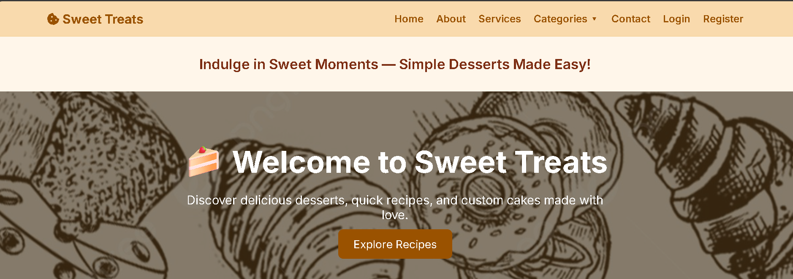

### 🍲 Home Recipes  

### 🧭 Home Navigations  
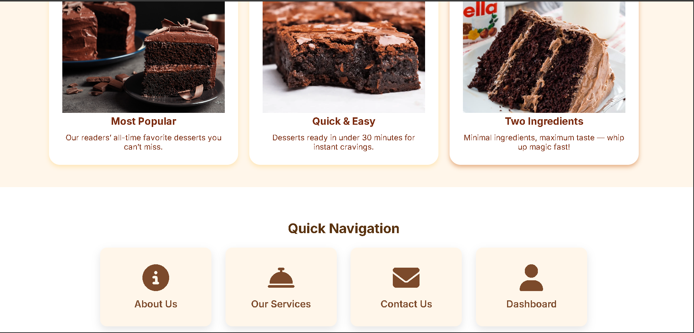

### 🏡 Home Overview 
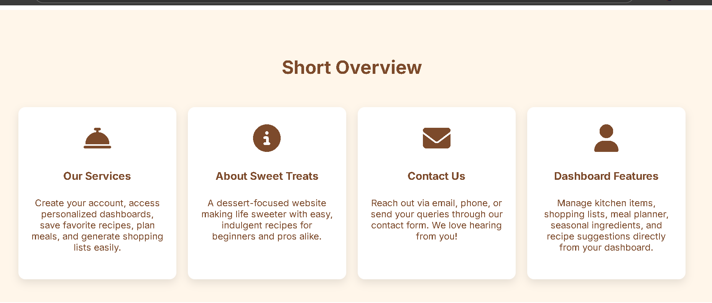

### 💡 Home Protips
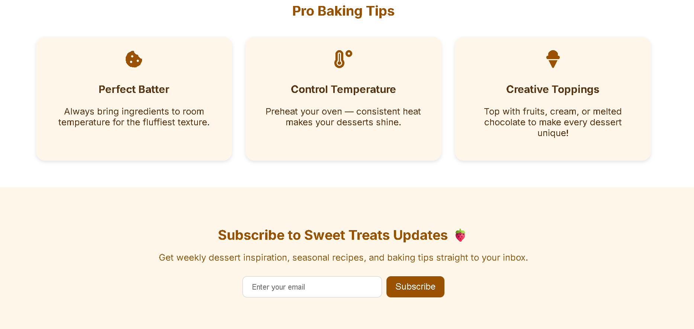

### ⚓ Footer Page 

### ℹ️ About Page  
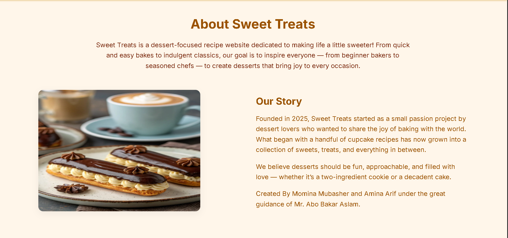

### 👥 About Us  
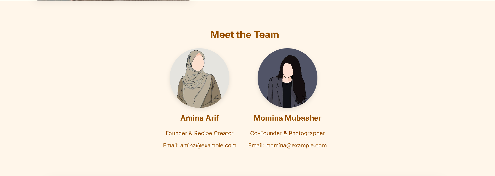

### 📍 Location 
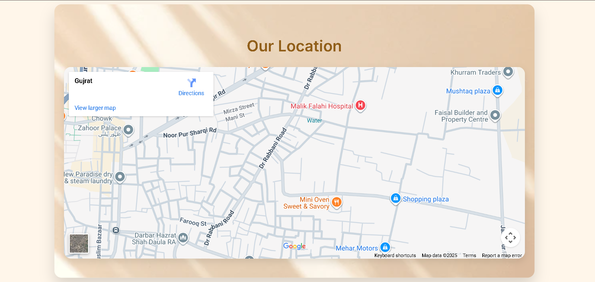

### 🧰 Services Page  
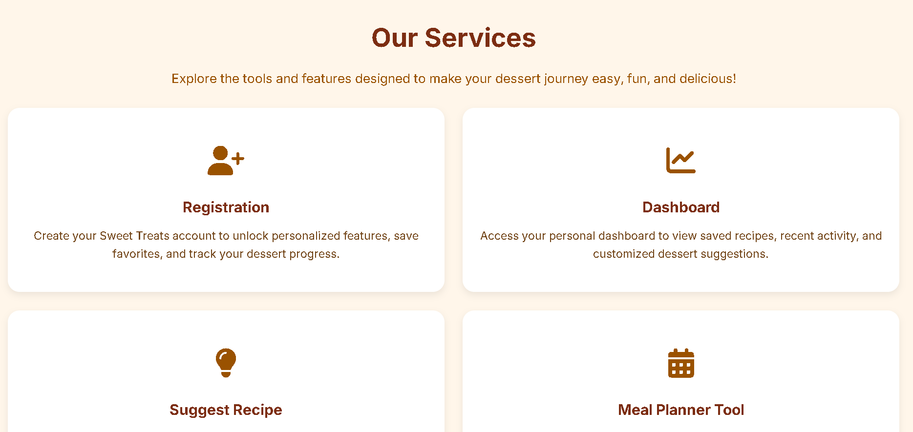

### 🧰 Services2 Page  
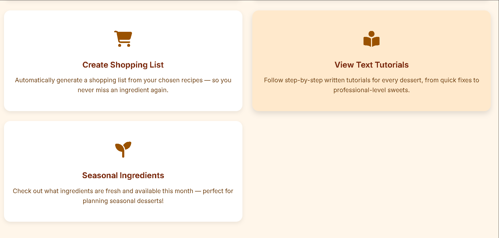

### 📂 Categories Page  
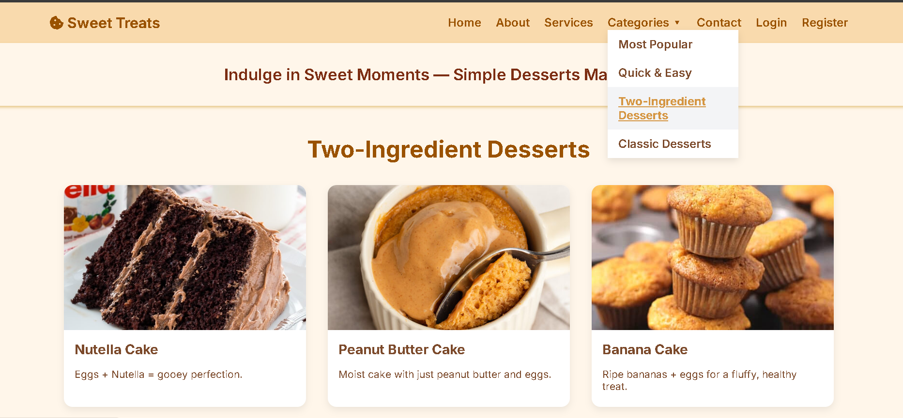

### 📄 Recipe Detail 

### 📞 Contact Page  
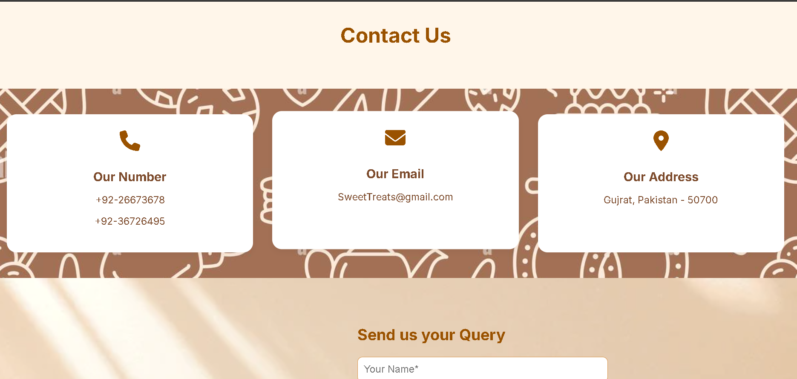

### ✉️ Send us your query  
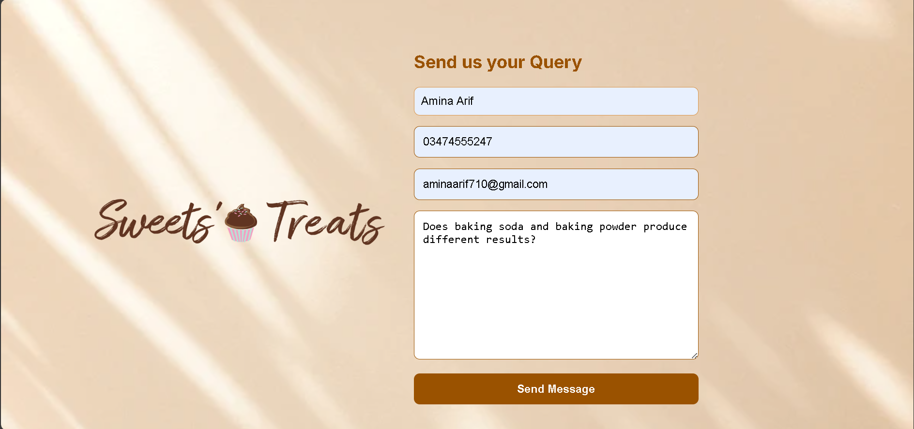

### 🔑 Login Page  
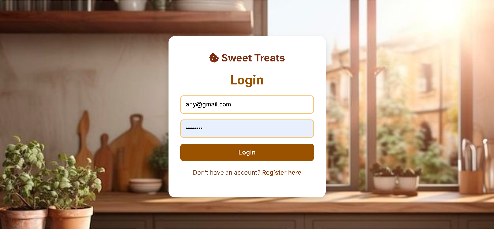

### 📝 Register Page  
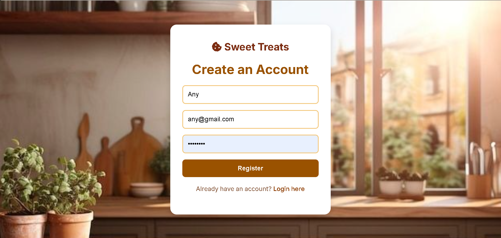

### 📊 Dashboard  
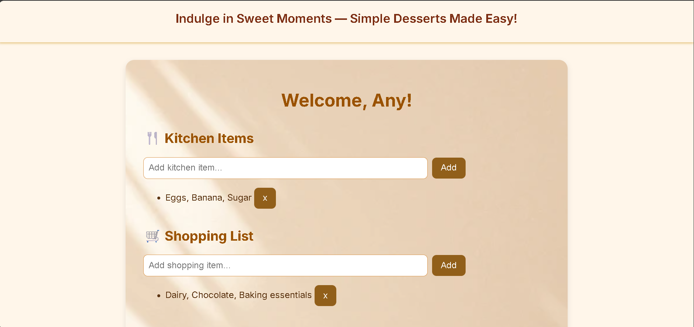

### 📅 Meal Planner Running  
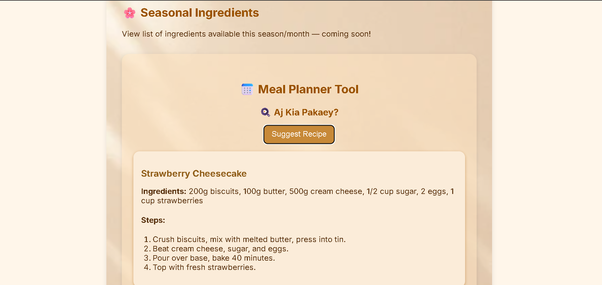

### 💻 Frontend Running  
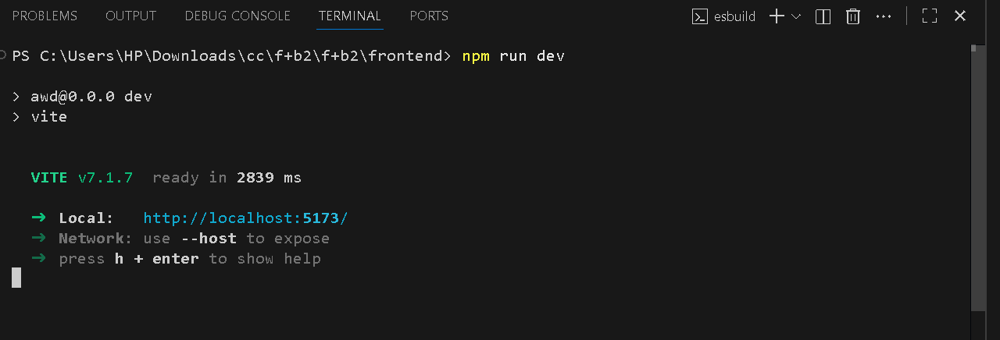

### 🧠 Backend Running  
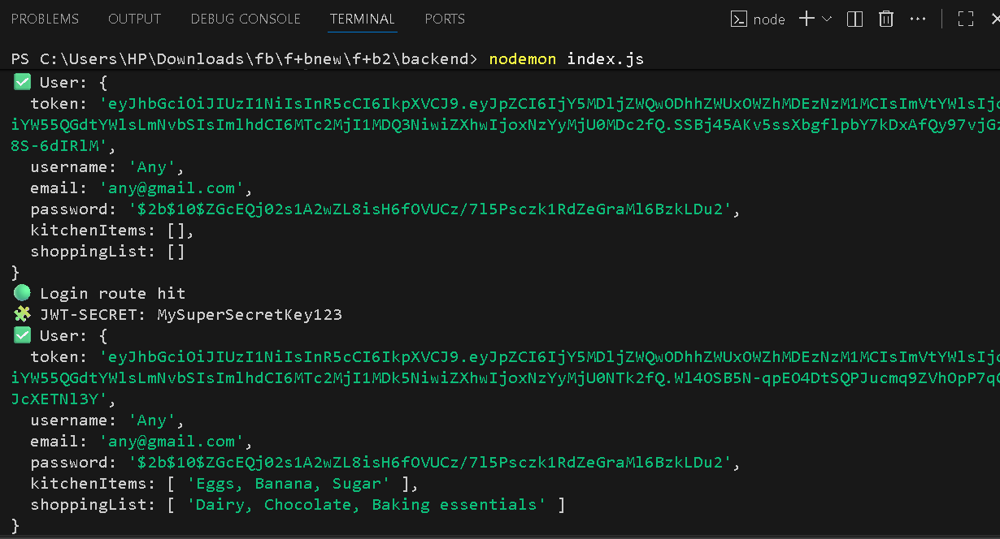

### 🍛 MongoDB Recipe  
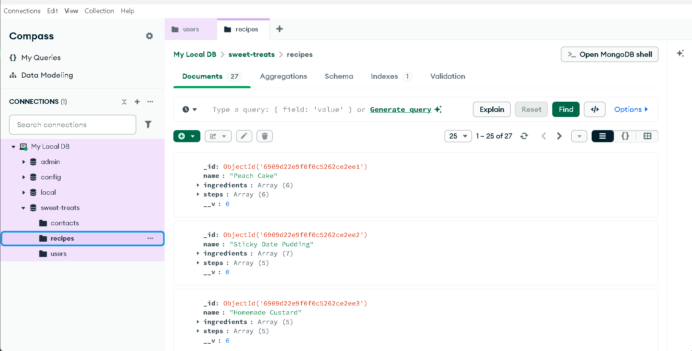

### 👥 MongoDB User 
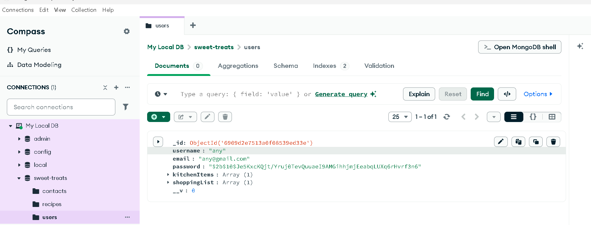

### 💾 Local Storage 
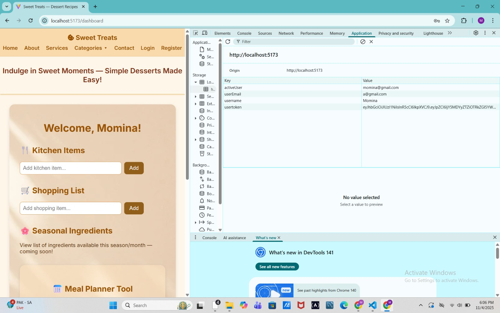

---

## 💻 Frontend Setup (Recipe Finder App)

The frontend is built using **React + Vite**.  
It contains all the UI pages like Home, Categories, Dashboard, About, Services, Contact, Login, and Register.

### ▶️ Steps to Run Frontend

 Navigate to the frontend folder  
   

### 🚀 Backend Setup (Node + Express + MongoDB)

 Navigate to the backend folder

### 💾 Local Storage
💾 Local Storage: A built-in browser feature that stores data locally on the user’s device, keeping it available even after the page is reloaded.
   
---

## 🧠 Tech Stack Used

### 🖥️ Frontend
- React + Vite  
- React Router DOM  
- Custom CSS  

### ⚙️ Backend
- Node.js   
- MongoDB (Database)  
- Mongoose (ODM)  
- JWT Authentication  
- bcrypt for password hashing  
- CORS & dotenv for configuration

---

## 🧾 API Endpoints (Example)

| Method | Endpoint | Description |
|--------|-----------|-------------|
| POST | `/api/register` | Register new user |
| POST | `/api/login` | Login and get JWT token |
| GET | `/api/recipes` | Get all recipes |
| GET | `/api/mealplan` | Get meal planner data |

---

## 👩‍💻 Author

**Amina Arif** &
**Momina Mubasher**  
📧 Email : [1485mina@gmail.com]
🌐 GitHub : [https://github.com/Mina-85148]

---

### 🎯 Summary
Recipe Finder App allows users to:
- Discover delicious recipes 🍰  
- Plan daily meals 🍽️  
- Save and manage favorite recipes ❤️  
- Connect with backend API using JWT authentication 🔐  

---

⭐ If you like this project, don’t forget to star the repo!

---

⚠️ Alert:
Before running the project, please make sure to execute node seedRecipes.js in the backend terminal.
This command will insert the recipes into the "sweet-treats" MongoDB database.
If you skip this step, the database will remain empty and no recipes will appear on the frontend.
